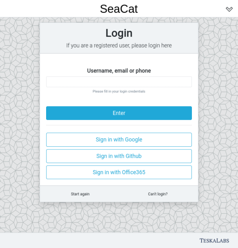
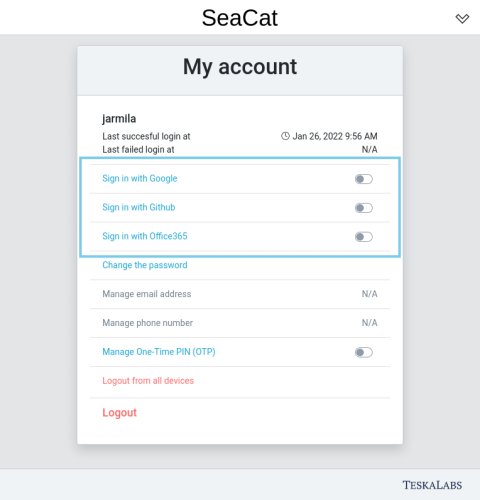

# External login

SeaCat Auth supports login via third party authentication providers.
This allows users to use their Google or Github account to log into SeaCat Auth.

SeaCat Auth currently supports these login providers:

- Google
- Office 365
- Github
- MojeID
- Facebook
- AppleID


## Usage

Once configured, external login options are available on the login screen 
as an alternative to the standard SeaCat Auth login.



Any user can enable or disable their external login options on their _My account_ screen. 



---

## Setting up external login providers

Setting up external login requires registering and configuring your SeaCat Auth site at the respective provider
and configuring the SeaCat Auth service itself.

### Register your SeaCat Auth application

Once you select which login provider you want to set up, proceed to their website 
to register your SeaCat Auth application.
You will receive **Client ID** and **Client secret** which you will use in SeaCat Auth configuration.

## Provide redirect URIs

Most OAuth2 providers will require you to specify a list of exact **authorized redirect URIs**.
If that is the case, you need to provide two URIs in the following format:

```
<SEACAT_PUBLIC_API_BASE_URL>/public/ext-login/<LOGIN_PROVIDER_ID>
<SEACAT_PUBLIC_API_BASE_URL>/public/ext-login-add/<LOGIN_PROVIDER_ID>
```

*For example, if your public SeaCat Auth API is running at `https://auth.example.xyz/auth/api/seacat_auth/` 
and you want to configure login with `google`, add these addresses to the list of authorized redirect URIs
in Google API Credentials.*

```
https://auth.example.xyz/auth/api/seacat_auth/public/ext-login/google
https://auth.example.xyz/auth/api/seacat_auth/public/ext-login-add/google
```

Other providers (e.g. Github) do not require a list of exact URIs but rather a single path 
that all of your redirect URIs will start with.
In such cases just provide the base URL of your SeaCat Auth public API, for example

```
https://auth.example.xyz/auth/api/seacat_auth/public/
```

### Configure SeaCat Auth

Finally, you can add a section defining your external login provider in the [SeaCat Auth config file](../config).
You will need at least the **Client ID** and the **Client secret** that you received at your login provider. 

The config section name is always in the format `[seacatauth:<LOGIN_PROVIDER_ID>]`.
See below for config examples of the individual login providers.

---

## Supported providers

SeaCat Auth currently supports the following external login providers:

- Google
- Office 365
- Github
- Moje ID

### Google

Provider ID: `google`

Register your SeaCat Auth app in [Google API Credentials](https://console.cloud.google.com/apis/credentials).

```ini
[seacatauth:google]
client_id=a2c4e6...
client_secret=1b3d5f...
```

### Office 365

Provider ID: `office365`

Register your SeaCat Auth app in [Azure Active Directory](https://portal.azure.com). 

In addition to client ID and client secret, Office 365 login also requires you to fill in your **tenant ID**.

```ini
[seacatauth:office365]
tenant_id=def123...
client_id=a2c4e6...
client_secret=1b3d5f...
```

### Github

Provider ID: `github`

Register your SeaCat Auth app in your [Github developer settings](https://github.com/settings/developers).

```ini
[seacatauth:github]
client_id=a2c4e6...
client_secret=1b3d5f...
```

### MojeID

Provider ID: `mojeid`

Sign up for a [MojeID provider account](https://www.mojeid.cz/cs/pro-poskytovatele/jak-zavest/).
Follow [their documentation](https://www.mojeid.cz/dokumentace/html/ImplementacePodporyMojeid/OpenidConnect/PrehledKroku.html) 
to obtain client ID and secret.

```ini
[seacatauth:mojeid]
client_id=a2c4e6...
client_secret=1b3d5f...
```

### AppleID

Provider ID: `appleid`

Register your app in [Apple Developer program Service ID settings](https://developer.apple.com/account/resources/identifiers/list/serviceId)
to obtain client ID. 
Apple returns e-mail and username in the response right after OAuth2 /authorize call, so we do not need client_secret,
because we do not need to hit the /token endpoint at all.

Sign in with Apple [documentation](https://developer.apple.com/documentation/sign_in_with_apple/) 

```ini
[seacatauth:appleid]
client_id=a2c4e6...
```