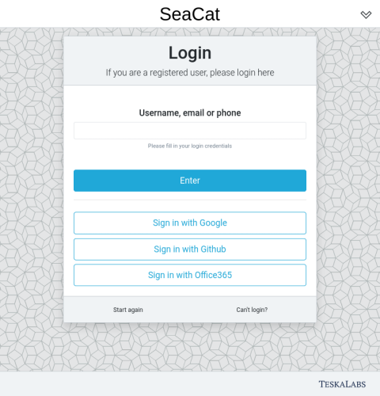

# Externí přihlášení

SeaCat Auth podporuje přihlášení prostřednictvím autentizačních poskytovatelů třetích stran. To umožňuje uživatelům používat svůj účet Google nebo Github k přihlášení do SeaCat Auth.

SeaCat Auth v současnosti podporuje tyto poskytovatele přihlášení:

- Google
- Office 365
- Github
- MojeID
- Facebook
- AppleID


## Použití

Jakmile je externí přihlášení nakonfigurováno, jsou možnosti přihlášení k dispozici na přihlašovací obrazovce jako alternativa ke standardnímu přihlášení SeaCat Auth.



Každý uživatel může na své obrazovce _Můj účet_ povolit nebo zakázat své možnosti externího přihlášení.


---

## Nastavení externích poskytovatelů přihlášení

Nastavení externího přihlášení vyžaduje registraci a konfiguraci vašeho webu SeaCat Auth u příslušného poskytovatele a konfiguraci samotné služby SeaCat Auth.

### Zaregistrujte svou aplikaci SeaCat Auth

Jakmile si vyberete, který poskytovatel přihlášení chcete nastavit, přejděte na jejich webové stránky a zaregistrujte svou aplikaci SeaCat Auth. Obdržíte **Client ID** a **Client secret**, které použijete v konfiguraci SeaCat Auth.

## Poskytněte přesměrovací URI

Většina poskytovatelů OAuth2 vyžaduje, abyste specifikovali seznam přesných **autorizovaných přesměrovacích URI**. Pokud je to váš případ, musíte poskytnout dvě URI v následujícím formátu:

```
<SEACAT_PUBLIC_API_BASE_URL>/public/ext-login/<LOGIN_PROVIDER_ID>
<SEACAT_PUBLIC_API_BASE_URL>/public/ext-login-add/<LOGIN_PROVIDER_ID>
```

*Například, pokud vaše veřejné API SeaCat Auth běží na `https://auth.example.xyz/auth/api/seacat_auth/` a chcete nakonfigurovat přihlášení s `google`, přidejte tyto adresy do seznamu autorizovaných přesměrovacích URI v Google API Credentials.*

```
https://auth.example.xyz/auth/api/seacat_auth/public/ext-login/google
https://auth.example.xyz/auth/api/seacat_auth/public/ext-login-add/google
```

Jiní poskytovatelé (např. Github) nevyžadují seznam přesných URI, ale spíše jedinou cestu, se kterou všechny vaše přesměrovací URI začnou. V takových případech stačí poskytnout základní URL vašeho veřejného API SeaCat Auth, například

```
https://auth.example.xyz/auth/api/seacat_auth/public/
```

### Nakonfigurujte SeaCat Auth

Nakonec můžete přidat sekci definující vašeho externího poskytovatele přihlášení do [konfiguračního souboru SeaCat Auth](../config). Budete potřebovat alespoň **Client ID** a **Client secret**, které jste obdrželi od svého poskytovatele přihlášení.

Název konfigurační sekce je vždy ve formátu `[seacatauth:<LOGIN_PROVIDER_ID>]`. Níže naleznete příklady konfigurace jednotlivých poskytovatelů přihlášení.

---


## Podporovaní poskytovatelé

SeaCat Auth v současnosti podporuje následující externí poskytovatele přihlášení:

- Google
- Office 365
- Github
- Moje ID

### Google

Provider ID: `google`

Zaregistrujte svou aplikaci SeaCat Auth v [Google API Credentials](https://console.cloud.google.com/apis/credentials).

```ini
[seacatauth:google]
client_id=a2c4e6...
client_secret=1b3d5f...
```

### Office 365

Provider ID: `office365`

Zaregistrujte svou aplikaci SeaCat Auth v [Azure Active Directory](https://portal.azure.com).

Kromě client ID a client secret vyžaduje přihlášení Office 365 také vyplnění vašeho **tenant ID**.

```ini
[seacatauth:office365]
tenant_id=def123...
client_id=a2c4e6...
client_secret=1b3d5f...
```

### Github

Provider ID: `github`

Zaregistrujte svou aplikaci SeaCat Auth ve svých [Github developer settings](https://github.com/settings/developers).

```ini
[seacatauth:github]
client_id=a2c4e6...
client_secret=1b3d5f...
```

### MojeID

Provider ID: `mojeid`

Zaregistrujte se pro účet [MojeID provider](https://www.mojeid.cz/cs/pro-poskytovatele/jak-zavest/). 
Postupujte podle [jejich dokumentace](https://www.mojeid.cz/dokumentace/html/ImplementacePodporyMojeid/OpenidConnect/PrehledKroku.html) 
pro získání client ID a secret.

```ini
[seacatauth:mojeid]
client_id=a2c4e6...
client_secret=1b3d5f...
```

### AppleID

Provider ID: `appleid`

Zaregistrujte svou aplikaci v [Apple Developer program Service ID settings](https://developer.apple.com/account/resources/identifiers/list/serviceId) pro získání client ID. 
Apple vrací e-mail a uživatelské jméno v odpovědi hned po volání OAuth2 /authorize, takže nepotřebujeme client_secret, 
protože nemusíme hitovat endpoint /token vůbec.

Dokumentace pro přihlášení pomocí Apple [dokumentace](https://developer.apple.com/documentation/sign_in_with_apple/) 

```ini
[seacatauth:appleid]
client_id=a2c4e6...
```

---


## Registrace neznámých uživatelů prostřednictvím webhooku

Když se neznámý uživatel přihlásí prostřednictvím externího poskytovatele identity, je možné spustit webhook na externí 
službu. Tato služba může registrovat uživatele a vrátit jejich credential ID. Pokud odpověď obsahuje platný 
`credential_id`, přihlášení probíhá úspěšně.

Pro povolení webhooku specifikujte URL webhooku v konfiguračním souboru:
```ini
[seacatauth:external_login]
registration_webhook_uri=http://localhost:8089/external-registration
```

Webhook je POST požadavek s JSON payload obsahujícím následující vlastnosti:

- `provider_type` - typ poskytovatele identity (např. google nebo appleid),
- `authorization_response` - parametry dotazu odpovědi bez autorizačního kódu,
- `user_info` - OpenID UserInfo-like nároky o přihlášeném uživateli (povinné `sub`, volitelné `email`, 
    `preferred_username` atd.). Skutečné nároky se liší mezi poskytovateli a také závisí na vašem 
    rozsahu a konfiguraci klienta.

Úspěšná odpověď webhooku musí obsahovat platný credential_id vytvořených přihlašovacích údajů. 
Jinak je odpověď považována za chybu a přihlášení končí neúspěchem.


### Příklad

Požadavek:
```
POST /webhook_url
{
  "provider_type": "google",
  "authorization_response": {
    "scope": "email profile openid https://www.googleapis.com/auth/userinfo.profile https://www.googleapis.com/auth/userinfo.email",
    "authuser": "0",
    "prompt": "consent"
  },
  "user_info": {
    "iss": "accounts.google.com",
    "sub": "01234567890123456789",
    "email": "abcdefgh@gmail.com",
    "email_verified": true
  }
}
```

Odpověď:
```
{
  "credential_id": "mongodb:custom:abcd123456789"
}
```