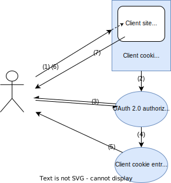

# Integrace aplikací se SeaCat Auth

_TeskaLabs SeaCat Auth_ může být použit jako řešení _Single Sign-On_ pro různé aplikace. Díky takové integraci můžete používat své Active Directory, LDAP nebo sociální přihlášení (např. Google, GitHub, Microsoft Office, ...) pro autentizaci uživatelů.

 * [TheHive](the-hive)
 * [ElasticSearch/Kibana](elk)
 * [Grafana](grafana)

## NGINX

Aplikační brána pro TeskaLabs SeaCat Auth je [NGINX](https://www.nginx.com). NGINX izoluje veřejnou síť (Internet) od interní privátní sítě a slouží jako takzvaný "interceptní bod" pro autentizaci. Více instancí NGINX může být provozováno současně.

Prohlížeč a příslušné webové a mobilní aplikace používají _Access tokens_ nebo _Cookies_ pro autentizační účely.

NGINX zachycuje příchozí požadavky z veřejné sítě a ve spolupráci s TeskaLabs SeaCat Auth vyměňuje _Access tokens_ / _Cookies_ za _ID tokens_ a další nakonfigurované autentizační informace. _ID Token_ je přidán NGINX do HTTP hlavičky příchozích požadavků.

_ID Token_ je poté interně používán mikroservisy a zdrojem autentizace a autorizace.

### Architektura

## Autorizace pomocí cookies pro ne-OAuth klienty

Seacat Auth poskytuje autorizaci založenou na cookies pro starší webové stránky a aplikace, které nepodporují OAuth 2.0. Jeho `PUT /nginx/introspect/cookie` koncový bod je navržen tak, aby fungoval s reverzním proxy Nginx a jeho direktivou `auth_request`.

### Tok autorizace pomocí cookies

**(1)** Uživatel chce získat přístup k obsahu klienta, například k webové aplikaci Kibana, která je chráněna introspekcí cookies. Seacat Auth zkoumá požadavek, aby zjistil, zda je autentizován a autorizován s platnou klientskou cookie. Pokud ano, uživateli je vrácen obsah klienta (7). Pokud ne, uživatel je veden procesem autorizace (2).

**(2)** Konec OAuth 2.0 autorizace kontroluje, zda je uživatel autentizován. Pokud ne, je veden procesem přihlášení (3). Pokud je autentizován, je přesměrován na vstupní bod klientské cookie (4).

**(3)** Seacat Auth vede uživatele procesem přihlášení, aby se vytvořila relace single sign-on a podrelace klienta (Kibana).

**(4)** Uživatel je přesměrován na vstupní bod cookie.

**(5)** Vstupní bod cookie odešle uživateli klientskou cookie, která slouží jako identifikátor nové klientské relace.

**(6)** Uživatel odešle autorizovaný požadavek na přístup na klientskou stránku.

**(7)** Server odpovídá požadovaným obsahem klienta.