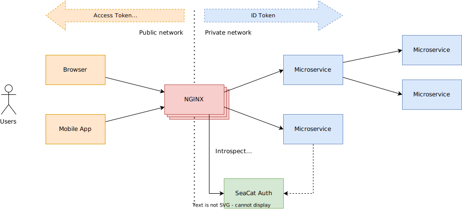

# Doporučené nasazení

Tato kapitola popisuje doporučený způsob nasazení TeskaLabs SeaCat Auth.

## Přehled architektury

## Popis

Doporučenou aplikační bránou pro TeskaLabs SeaCat Auth je [NGINX](https://www.nginx.com).
NGINX odděluje veřejnou síť (Internet) od interní privátní sítě a slouží jako tzv. "interceptní bod" pro autentizaci.
Více instancí NGINX může být provozováno současně.

Prohlížeč a příslušné webové aplikace a mobilní aplikace používají _Access tokens_ nebo _Cookies_ pro autentizační účely.

NGINX zachycuje příchozí požadavky z veřejné sítě a ve spolupráci s TeskaLabs SeaCat Auth vyměňuje _Access tokens_ / _Cookies_ za _ID tokens_ a další nakonfigurované autentizační informace.
_ID Token_ je přidán NGINX do HTTP hlavičky příchozích požadavků.

_ID Token_ je poté interně používán mikroservisy a zdrojem autentizace a autorizace.