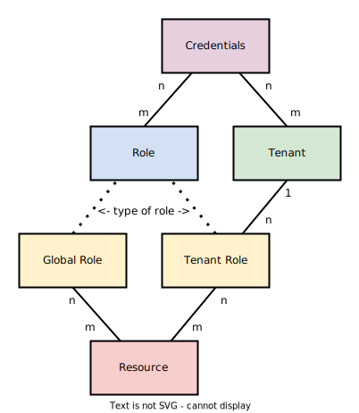

# Zdroje

## Řízení přístupu založené na rolích (RBAC)

### Přihlašovací údaje
- Sada přihlašovacích údajů obvykle odpovídá uživatelskému účtu, ale může to být také strojové přihlašovací údaje.

### Nájemce
- **Nájemce** je _"skupina uživatelů, kteří sdílejí společný přístup se specifickými oprávněními k instanci softwaru"_.
- Může to být společnost, oddělení, tým atd.
- Podle definice může mít nájemce více uživatelů (sad přihlašovacích údajů).
- Uživatel se může připojit k několika nájemcům.

### Role
- **Role** je pojmenovaná sada zdrojů, používá se k udělení přístupu uživatele k těmto zdrojům.
- Uživatel může mít více rolí.
- Role může být přiřazena více uživatelům.
- Role nájemce jsou platné pouze pro jednoho konkrétního nájemce.
- Globální role jsou platné napříč všemi nájemci.

### Zdroje
- **Zdroj** je identifikátor skutečného softwarového zdroje nebo akce provedené na tomto zdroji.
- Mít přístup k zdroji znamená mít práva k tomu, co představuje (`blog:post:create`, `my-repository:write`, `my-app:access` atd.)
- Jakýkoli zdroj může být přiřazen několika rolím.
- Role může mít více zdrojů.
- Zdroje nemohou být přiřazeny přímo k přihlašovacím údajům; přihlašovací údaje mohou mít přístup k zdroji pouze prostřednictvím role.

## SeaCat Auth administrativní zdroje

### `authz:superuser`

### `authz:tenant:access`

### `authz:impersonate`