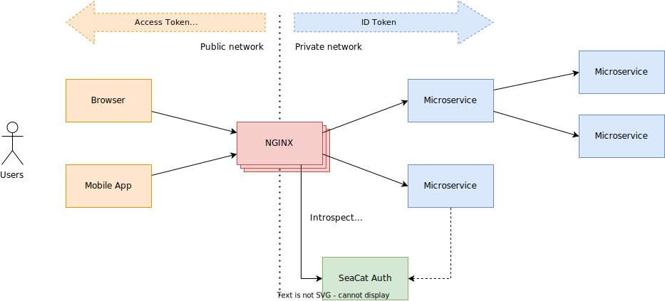
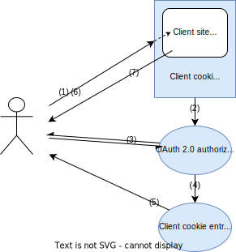

# Integrating apps with SeaCat Auth

_TeskaLabs SeaCat Auth_ can be used as a _Single Sign-On_ solution for various applications.
Thanks to such integration, you may use your Active Directory, LDAP or social logins (such as Google, GitHub, Microsoft Office, ...) for user authentication.

 * [TheHive](the-hive)
 * [ElasticSearch/Kibana](elk)
 * [Grafana](grafana)

## NGINX

The application gateway for TeskaLabs SeaCat Auth is [NGINX](https://www.nginx.com).
NGINX isolates the public network (Internet) from the internal private network and serves as so-called "interception point" for Authentication.
Multiple NGINX instances can be operated at once.

The browser respective web applications and mobile applications uses _Access tokens_ or _Cookies_ for authentication purposes.

NXING intercepts incoming requests from the public network and in cooperation with TeskaLabs SeaCat Auth, it exchanges the _Access tokens_ / _Cookies_ by _ID tokens_ and other configured authentication information.
_ID Token_ is added by NGINX to the HTTP header of incoming requests.

_ID Token_ is then used internally by microservices and authentication and authorization resource.

### Architecture

## Cookie authorization for non-OAuth clients

Seacat Auth provides cookie-based authorization for older websites and apps that do not support OAuth 2.0.
Its `PUT /nginx/introspect/cookie` endpoint is designed to work with Nginx reverse proxy and its `auth_request` directive.

### Cookie authorization flow

**(1)** The user wants to access client content, for example Kibana web application, which is protected by cookie introspection. Seacat Auth inspects the request to see if it is authenticated and authorized with a valid client cookie. If it is, the user is served back the client content (7). If it is not, the user is lead through the authorization process (2).

**(2)** OAuth 2.0 authorize endpoint checks that the user is authenticated. If not, they are taken through the login process (3). If authenticated, they are redirected to the client cookie entrypoint (4).

**(3)** Seacat Auth leads the user through the login process to establish a single sign-on session and a client (Kibana) subsession.

**(4)** The user is redirected to the cookie entry point.

**(5)** Cookie entry point sends the user a client cookie, which serves as the identificator of the new client session.

**(6)** The user sends an authorized request to access the client site.

**(7)** The server responds with requested client content.
