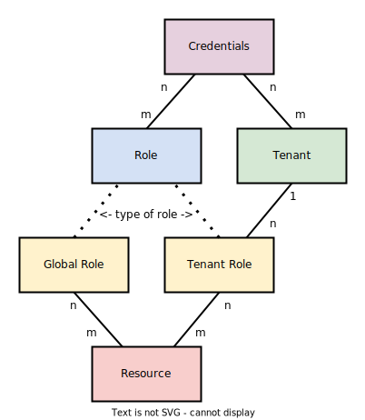

# Resources

## Resource-based Access Control (RBAC)

### Credentials
- A set of credentials typically corresponds to a user account, but they can be also machine-to-machine credentials.

### Tenant
- **Tenant** is _"a group of users who share a common access with specific privileges to a software instance"_.
- It can be a company, a department, a team etc.
- By definition, a tenant can have multiple users (sets of credentials).
- A user can join several tenants.

### Role
- **Role** is a named set of resources, it is used to grant user access to those resources.
- A user can have multiple roles.
- A role can be assigned to multiple users.
- Tenant roles are valid only for one specific tenant.
- Global roles are valid across all tenants.

### Resource
- **Resource** is an identifier of an actual software resource or an action performed on that resource.
- Having access to a resource means having rights to what it represents (`blog:post:create`, `my-repository:write`, `my-app:access` etc.)
- Any resource can be assigned to several roles.
- A role can have multiple resources.
- Resources cannot be assigned directly to credentials; credentials can have access to a resource only through a role.

## SeaCat Auth admin resources

### `seacat:access`

### `authz:superuser`

### `authz:tenant:access`

### `authz:impersonate`
